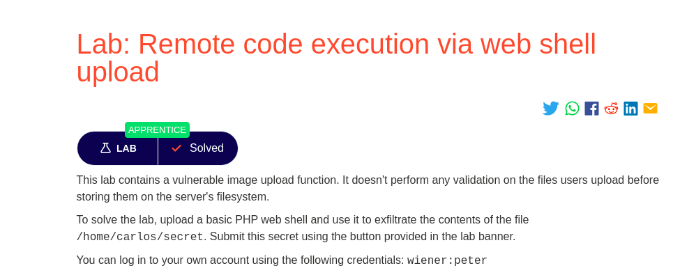
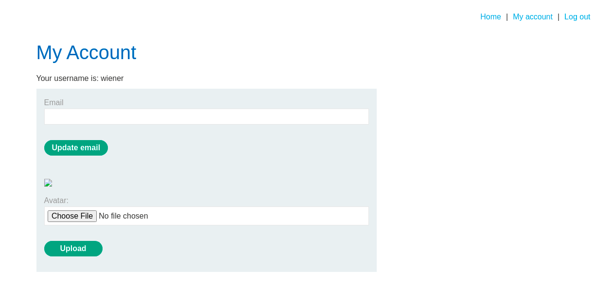
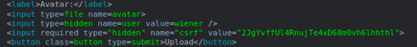
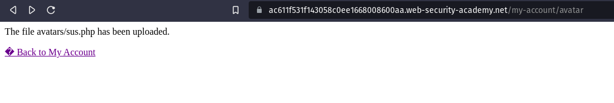
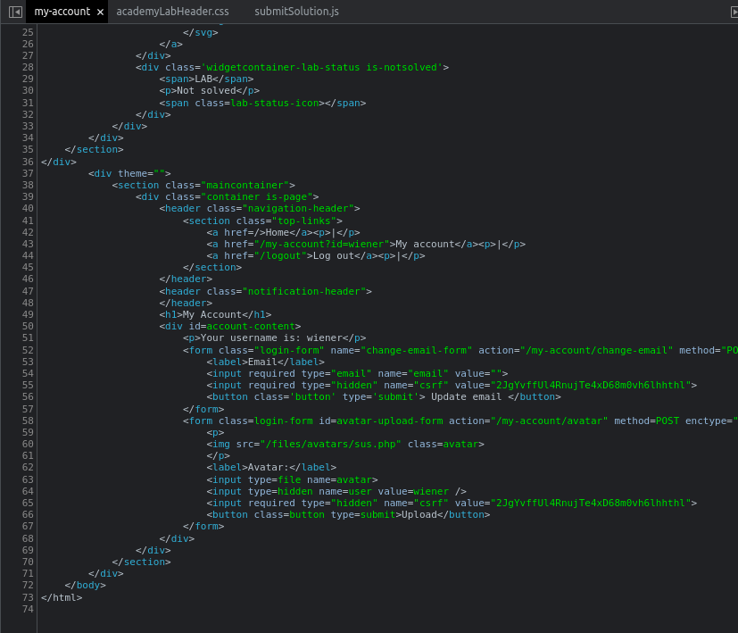
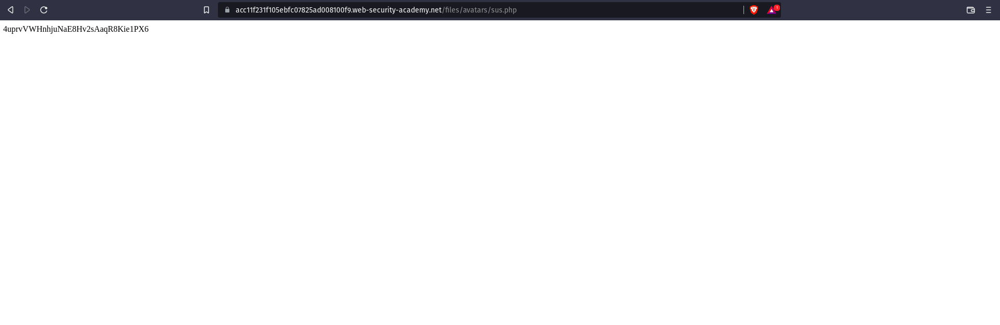

# Login

We can log in to your own account using the following credentials: 
```bash
wiener:peter
```
### We know this lab contains image upload function vunerablity. So lets start looking for it.

# Information gathering



We can upload the image file under Avatar lable.



From the image we know there is no file restiction to upload. Now we have to create an executable file to execute via web shell.

# Exploit

We have to create a php executable file which contains a script for fetching the contents of (/home/carlos/secret).

```bash
<?php echo file_get_contents('/home/carlos/secret'); ?>
```
or
```bash 
<?php
$sus = file_get_contents('/home/carlos/secret');
echo $sus
>
```




We successfully uploaded the executable file. Now we have to retive the output of the executable file. 



From the source code we can know the location of the uploaded file. Now we will redirect to the path in URL.



We got the Solution.

# Conclution
From this lab we gained the basic idea of remote code execution vunerablity.