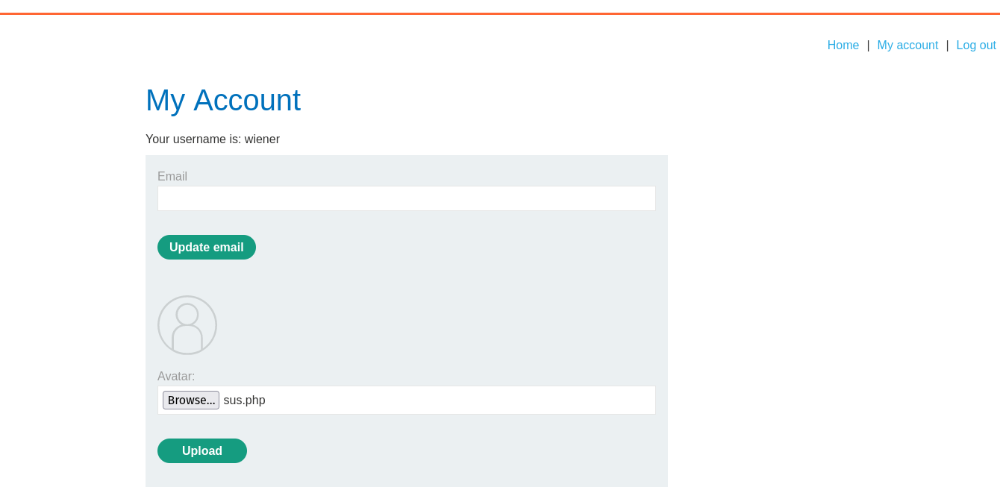
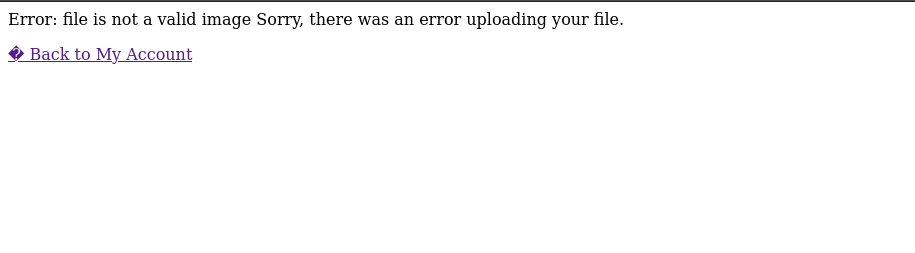
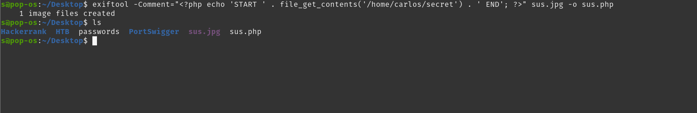
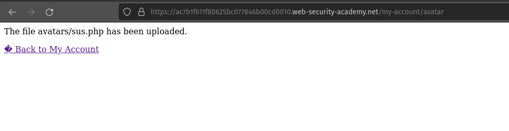
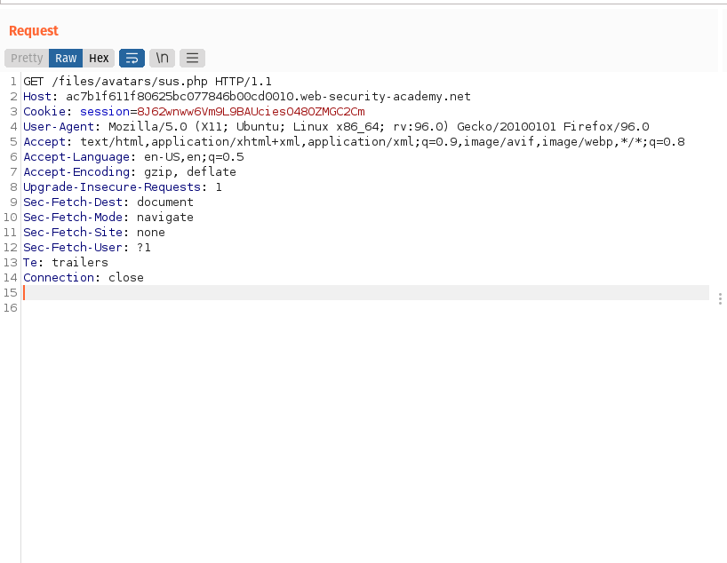
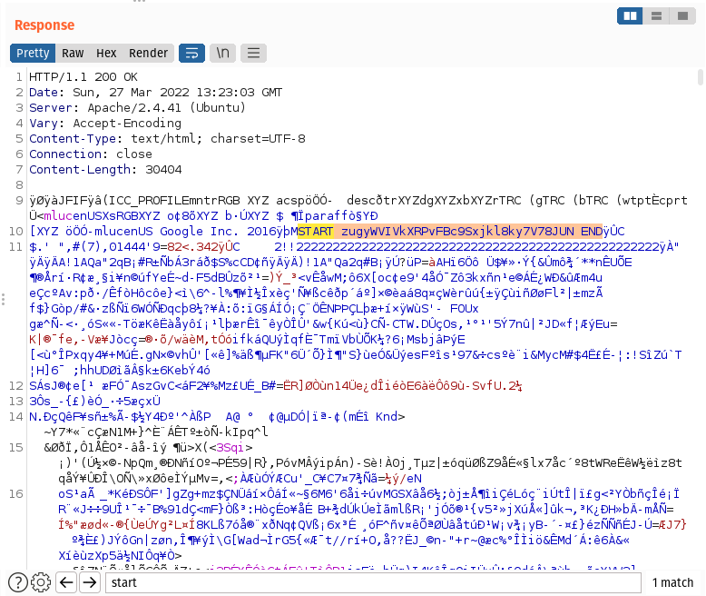

# Login

We can log in to your own account using the following credentials: 
```bash
wiener:peter
```
### We know this lab contains image upload function vunerablity. So lets start looking for it.

# Information gathering



We can upload the image file under Avatar lable.



From the image we know there is a file restiction to upload. The server blocks from uploading the file, Tried all techniques that we learned in previous labs.

# Exploit

We have to create a [polyglot](https://shouts.dev/articles/hide-payload-in-image-file-using-exiftool) php/jpg executable file which contains a script for fetching the contents of (/home/carlos/secret).

```bash
<?php echo file_get_contents('/home/carlos/secret'); ?>
```




We successfully uploaded the executable file. Now we have to retive the output of the executable file. 

Now in browser, Redirect to the upload page.



From BurpSuite HTTP history, Find the GET request GET /files/avatars/sus.php.



Response of the GET request GET files/avatars/sus.php, Now we have to search for word ***START***, You will find ***START "SOLUTION" END***

We got the Solution.

# Conclution
From this lab we gained the basic idea of remote code execution via polyglot file upload vunerablity.

