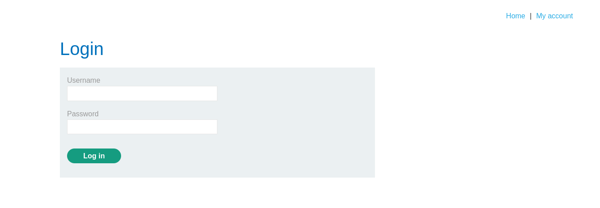
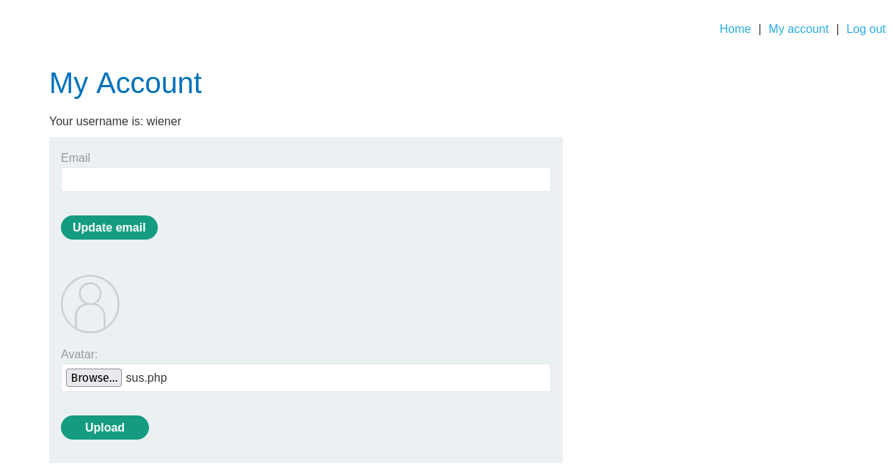
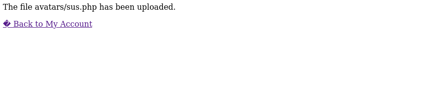
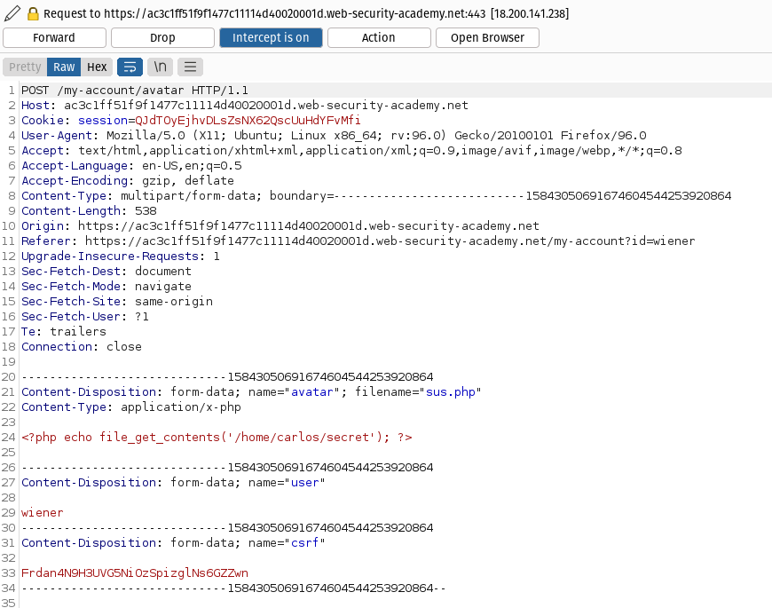
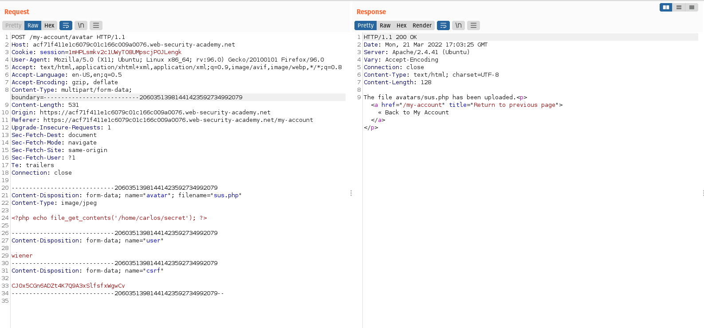
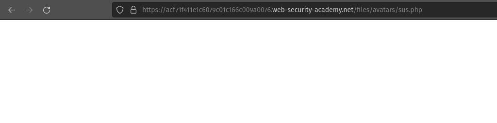
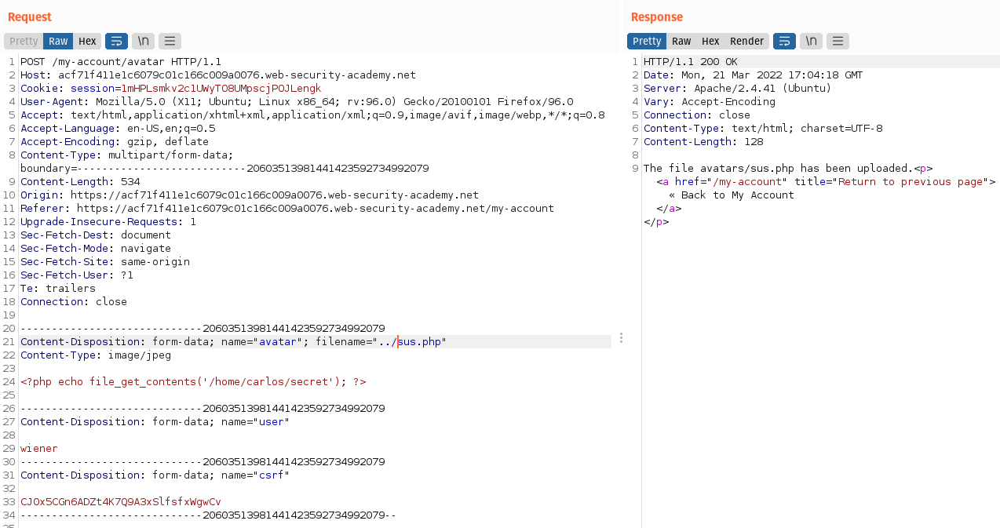
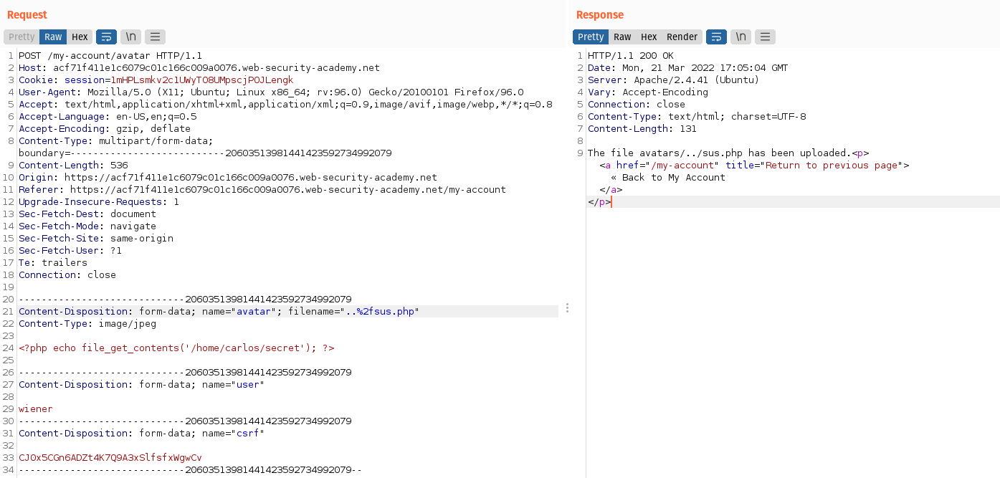
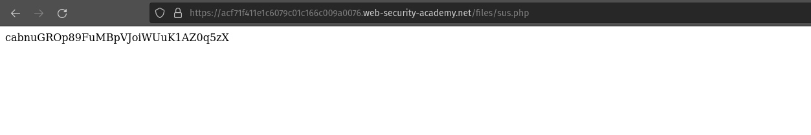

# Login

We can log in to your own account using the following credentials: 
```bash
wiener:peter
```
### We know this lab contains image upload function vunerablity. So lets start looking for it.

# Information gathering



We can upload the image file under Avatar lable.



From the image we know there is no file restiction to upload. Now we have to create an executable file to execute via web shell.

# Exploit

We have to create a php executable file which contains a script for fetching the contents of (/home/carlos/secret).

```bash
<?php echo file_get_contents('/home/carlos/secret'); ?>
```
or
```bash 
<?php
$sus = file_get_contents('/home/carlos/secret');
echo $sus
>
```


We successfully uploaded the executable file. Now we have to retive the output of the executable file.

We couldn't retive the output of the executed file.



From the above image we know the directory in which file is uploaded. Now we will redirect to the path in URL.



In Burp Repeater, go to the tab containing the GET /files/avatars/sus.php request. 

In the path, replace the name of your image file with exploit.php and send the request. 



But server retuned the content of the PHP file as plain text instead of executing the script.



Now in Burp Repeater from Content-Disposition header, We will change the filename to include a [directory traversal](https://owasp.org/www-community/attacks/Path_Traversal) sequences.

```bash
tent-Disposition: form-data; name="avatar"; filename="../sus.php"
Content-Type: image/jpeg

```

Send the request. If you notice that the response says The file avatars/sus.php has been uploaded. 



This suggests that the server is stripping the directory traversal sequence from the file name. The directory traversal sequence by URL encoding the forward slash (/) character. So we have to use encoded directory traversal sequence.

```bash
tent-Disposition: form-data; name="avatar"; filename="..%2fsus.php"
Content-Type: image/jpeg
```


After sending the request we can observe that the message now says The file avatars/../exploit.php has been uploaded. 

This indicates that the file name is being URL decoded by the server.



In the browser, Using path traversal sequence. We will get the carlos's secret as response.

We got the Solution.

# Understanding
This indicates that the file was uploaded to a higher directory in the filesystem hierarchy (/files), and subsequently executed by the server. That this means you can also request this file using GET /files/sus.php.

# Conclution
From this lab we gained the basic idea of Web shell upload via path traversal vunerablity.