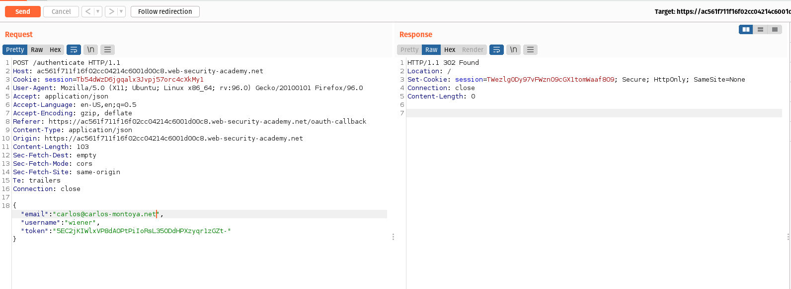

# Login

We can log in to your own account using the following credentials: 
```bash
wiener:peter
```
# Information gathering

Change to the BurpSuite proxy and click on "My account" and do the OAuth login proccess.

Afterwards, you will be redirected back to the blog website.


In Burp, go to "Proxy" > "HTTP history" and if you notice the requests and responses that make up the OAuth flow. 

A GET request from the authorization request GET /auth?client_id=[...].

If you notice that the client application/the blog website will be receiving some basic information about the user from the OAuth service. ***It then logs the user in by sending a POST request containing this information to its own /authenticate endpoint, along with the access token***.

# Exploit


Now send the POST request **POST /authenticate** to Burp Repeater. 



In Repeater, change the email address to carlos@carlos-montoya.net and send the request. If you observe that you do not encounter an error in response.
Right-click on the POST request and select **"Request in browser" > "In original session"**. 
You will get a URL now copy the URL and visit it in your browser.


You are logged in as Carlos and the lab is solved.


# Conclution
From this lab we gained the basic idea of Authentication bypass via OAuth implicit flow.

