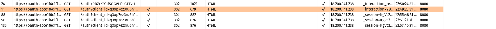

# Login

We can log in to your own account using the following credentials: 
```bash
wiener:peter
```
# Information gathering


While proxying HTTP History in Burp, click "My account" in website. 
You are taken to a normal login page, but notice that there is an option to log in using your social media profile. 

For recon, just log in to the blog website using the Username:Password login form.
```bash
wiener:peter
```


Observe that you can link your social media account to your account.

Now click on the ***Attach a social profile***. You will be redirected to the social media login page.


Login using social media credentials to OAuth flow, it will redirect to the blog.

```bash
peter.wiener:hotdog
```
 Log out and check on **My account** to redirect to the login page.

 This time try login with sign-in using **Login using social media**. If you notice it logged in instatly via newly linked social media account.



In BurpSuite in proxy HTTP history, go through the series of requests that happened while attaching the social media, You will find In the GET request **GET /auth?client_id=q3op7ez3ru6h1qc5hsrt3&redirect_uri=https://acf41f341f8489efc0e7975500d90038.web-security-academy.net/oauth-linking&response_type=code&scope=openid%20profile%20email HTTP/1.1**


Observe that the redirect_uri for this functionality sends the authorization code to /oauth-linking, Now notice that the request does not include a state parameter to protect against CSRF attacks.

Now turn on the Burp intercept and click on **Attach a social profile**

Go to Burp Proxy and forward any request untill you intercept request is **GET /oauth-linking?code=[...]**. Now right click on the request and select **Copy URL**


DROP the request(This is important to ensure this **GET /oauth-linking?code=[...]** is not used but the code will be valid).

Turn off the Burp intercept and log out from blog.

In website go to exploit server and create a [iframe](https://www.w3schools.com/tags/tag_iframe.asp) in which src attributes points to the url we just copied.

```bash
<iframe src="https://acf41f341f8489efc0e7975500d90038.web-security-academy.net/oauth-linking?code=b08LtgXIxpdFJN09g25zur195QBvIz7DzctuWr783_A"></iframe>
```
Click on **deliver exploit to the victim** it will complete the OAuth flow using your social media profile, attaching it to the admin account on the blog website

Go back to the blog website and select the "Log in with social media" option again. 


Observe that you are instantly logged in as the admin user. 

Go to the admin panel and delete Carlos to solve the lab.


Change to the BurpSuite proxy and click on "My account" and do the OAuth login proccess.

Afterwards, you will be redirected back to the blog website.

# Conclution
From this lab we gained the basic idea of Forced OAuth profile linkung using  user's session.